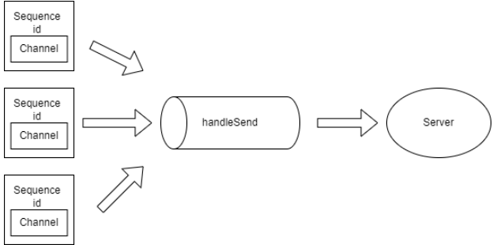
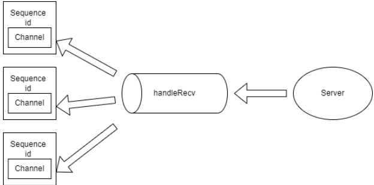

# 基于无侵入式的反射实现的序列化

由于 cpp 还未提供反射，所以一般项目里序列化里需要实现对应类的序列化，不仅繁琐还容易出错，使用宏也并没有本质差别，都是侵入式的序列化。

本项目使用无侵入式反射进行序列化，所谓无侵入式，即不改变类本身的业务的代码反射出对象的数据成员。

## 反射的作用

对于一个类

```cpp
struct Foo {
    int n;
    string str;
};
```

如果我们想对该类的对象进行序列化，在没有反射的情况下，需要由用户来手动来遍历该类的成员，例如

```cpp
struct Foo {
    int n;
    string str;
    friend Serializer& operator >> (Serializer& s, Foo& f) {
        s >> f.n >> f.str;
        return s;
    }
    friend Serializer& operator << (Serializer& out, Foo& f) {
        s << f.n << f.str;
        return s;
    }
};
```

这样就可以实现 Foo 类的序列化和反序列化。但正如前文所说，这样不仅繁琐还容易出错。

我们希望实现一个非侵入式的序列化，用户只要定义类就行，由框架来完成遍历类的成员并完成序列化和反序列化，直接做到以下效果，这就是反射的作用

```cpp
Foo foo;
Serializer s;
// 序列化
s << foo;
// 反序列化
s >> foo;
```

## 遍历类的成员

首先最为核心的地方，要想获取类的全部成员，在 cpp 17 里有个简单的方法，就是结构化绑定（structured binding）。

```cpp
Foo foo;
auto &&[a1, a2] = foo;
```

现在 a1 就是对 foo.n 的引用，a2 就是对 foo.str 的引用。

简单封装一下，我们需要定义一个高阶函数 VisitMembers，实现 Vistor 模式，其接受两个参数：

1. 反射的对象 auto&& object

2. 一个函数 visitor，对对象全部字段进行访问、操作，签名为 `void(auto &&...items)` ，其中参数为变参模板

```cpp
constexpr decltype(auto) VisitMembers(auto &&object, auto &&visitor) {
    using type = std::remove_cvref_t<decltype(object)>;
    constexpr auto Count = MemberCount<type>();
    ...
    if constexpr (Count == 0) {
        return visitor();
    }
    else if constexpr (Count == 1) {
        auto &&[a1] = object;
        return visitor(a1);
    }
    else if constexpr (Count == 2) {
        auto &&[a1, a2] = object;
        return visitor(a1, a2);
    }
    else if constexpr (Count == 3) {
        auto &&[a1, a2, a3] = object;
        return visitor(a1, a2, a3);
    }
    ...
}
```

代码实现里一直暴力枚举下去。

VisitMembers 里先获取类的成员数量，然后利用 if constexpr 来编译期生成对应成员数量的结构化绑定，将全部成员转发给 visitor，这就完成了对对象成员的访问。

到目前为止都很简单，但有个问题，MemberCount 获取类的成员数量该如何实现，这也是最为魔法的地方。

## 获取类的成员数量

MemberCount 的真正实现是 MemberCountImpl

```cpp
template <typename T>
consteval std::size_t MemberCount() {
    ...
    return MemberCountImpl<T>();
}
```

MemberCountImpl 实现如下

```cpp
struct UniversalType {
    template <typename T>
    operator T();
};

template <typename T, typename... Args>
consteval std::size_t MemberCountImpl() {
    if constexpr (requires {
        T {
            {Args{}}...,
            {UniversalType{}}
        };
    }) {
        return MemberCountImpl<T, Args..., UniversalType>();
    } else {
        return sizeof...(Args);
    }
}
```

要想理解这个函数必须先理解这个 concept 约束了什么。

这里涉及到了一个特性

```cpp
struct Foo {
    int a;
    int b;
    int c;
};
```

对于一个聚合类 Foo，以下初始化方法都是合法的

```cpp
Foo a{1};
Foo a{1, 2};
Foo a{1, 2, 3};
```

concept 里借助了一个万能类型 UniversalType，UniversalType 中有一个可以隐式转换成任意类的稻草人函数。然后将所有的变参 UniversalType 展开检查初始化类 T 时的参数个数是否合法。

第一个分支通过不断构造新的 UniversalType，当 concept 不满足时，说明当前参数的个数就等于类的成员数量。

## 序列化实现

```cpp
template<typename T>
Serializer& operator << (const T& i){
    using T = std::remove_cvref_t<Type>;
    static_assert(!std::is_pointer_v<T>);
    if constexpr(std::is_same_v<T, bool> || std::is_same_v<T, char> || std::is_same_v<T, unsigned char>){
        m_byteArray->writeFint8(t);
    } else if constexpr(std::is_same_v<T, float>){
        m_byteArray->writeFloat(t);
    } else if constexpr(std::is_same_v<T, double>){
        m_byteArray->writeDouble(t);
    } else if constexpr(std::is_same_v<T, int8_t>){
        m_byteArray->writeFint8(t);
    } else if constexpr(std::is_same_v<T, uint8_t>){
        m_byteArray->writeFuint8(t);
    } else if constexpr(std::is_same_v<T, int16_t>){
        m_byteArray->writeFint16(t);
    } else if constexpr(std::is_same_v<T, uint16_t>){
        m_byteArray->writeFuint16(t);
    } else if constexpr(std::is_same_v<T, int32_t>){
        m_byteArray->writeInt32(t);
    } else if constexpr(std::is_same_v<T, uint32_t>){
        m_byteArray->writeUint32(t);
    } else if constexpr(std::is_same_v<T, int64_t>){
        m_byteArray->writeInt64(t);
    } else if constexpr(std::is_same_v<T, uint64_t>){
        m_byteArray->writeUint64(t);
    } else if constexpr(std::is_same_v<T, std::string>){
        m_byteArray->writeStringVint(t);
    } else if constexpr(std::is_same_v<T, char*>){
        m_byteArray->writeStringVint(std::string(t));
    } else if constexpr(std::is_same_v<T, const char*>){
        m_byteArray->writeStringVint(std::string(t));
    } else if constexpr(std::is_enum_v<T>){
        m_byteArray->writeInt32(static_cast<int32_t>(t));
    } else if constexpr(std::is_class_v<T>) {
        static_assert(std::is_aggregate_v<T>);
        VisitMembers(t, [&](auto &&...items) {
            (void)((*this) << ... << items);
        });
    }
    return *this;    
}
```

在最后一个if constexpr 里，判断是否为聚合类，然后遍历所有的成员进行序列化。

当然，由于不是原生的反射，还是有许多缺陷，比如无法对一个非聚合类进行自动序列化，此时依旧可以通过模板特化来手动实现，例如

```cpp
class Foo {
private:
    int a;
    int b;
public:    
    friend Serializer& operator >> (Serializer& s, Foo& f) {
        s >> f.n >> f.str;
        return s;
    }
    friend Serializer& operator << (Serializer& out, Foo& f) {
        s << f.n << f.str;
        return s;
    }
};
```

# RPC协议的设计
```cpp
|  magic | version|  type  |          sequence id              |          content length           |             content byte[]                                                     |
+--------+--------+--------+--------+--------+--------+--------+--------+--------+--------+--------+--------+--------+--------+--------+--------+--------+--------+--------+--------+
```

封装通信协议，使RPC Server和RPC Client 可以基于同一协议通信。

采用私有通信协议，协议如下：

`magic`: 协议魔法数字。一个字节

`version`: 协议版本号，以便对协议进行扩展，使用不同的协议解析器。一个字节

`type`: 消息请求类型。一个字节

`sequence id`: 一个32位序列号，用来识别请求顺序。四个字节

`content length`: 消息长度，即后面要接收的内容长度。四个字节

`content byte`: 消息具体内容。

目前提供了以下几种请求

```cpp
enum class MsgType : uint8_t {
    HEARTBEAT_PACKET,       // 心跳包
    RPC_PROVIDER,           // 向服务中心声明为provider
    RPC_CONSUMER,           // 向服务中心声明为consumer
    
    RPC_REQUEST,            // 通用请求
    RPC_RESPONSE,           // 通用响应
    
    RPC_METHOD_REQUEST ,    // 请求方法调用
    RPC_METHOD_RESPONSE,    // 响应方法调用
    
    RPC_SERVICE_REGISTER,   // 向中心注册服务
    RPC_SERVICE_REGISTER_RESPONSE,
    
    RPC_SERVICE_DISCOVER,   // 向中心请求服务发现
    RPC_SERVICE_DISCOVER_RESPONSE
    
    RPC_SUBSCRIBE_REQUEST,  // 订阅
    RPC_SUBSCRIBE_RESPONSE,

    RPC_PUBLISH_REQUEST,    // 发布
    RPC_PUBLISH_RESPONSE
};
```

## RPC的连接多路复用与分解
本篇将探讨rpc连接多路复用与多路分解的设计思路与实现。

### 问题分析

对于短连接来说，每次发起rpc调用就创建一条连接，由于没有竞争实现起来比较容易，但开销太大。所以本框架实现了rpc连接复用来支持更高的并发。

连接复用的问题在于，在一条连接上可以有多个并发的调用请求，由于服务器也是并发处理这些请求的，所以导致了服务器返回的响应顺序与请求顺序不一致。为了识别请求，我们很容易想到一个方法，就是给每个连接每个请求加上一个唯一的序列号，本框架的做法是在协议头加上序列号字段，具体结构如下

```c
+--------+--------+--------+--------+--------+--------+--------+--------+--------+--------+--------+--------+--------+--------+--------+--------+--------+--------+--------+--------+
|  BYTE  |        |        |        |        |        |        |        |        |        |        |             ........                                                           |
+--------+--------+--------+--------+--------+--------+--------+--------+--------+--------+--------+--------+--------+--------+--------+--------+--------+--------+--------+--------+
|  magic | version|  type  |          sequence id              |          content length           |             content byte[]                                                     |
+--------+--------+--------+--------+--------+--------+--------+--------+--------+--------+--------+--------+--------+--------+--------+--------+--------+--------+--------+--------+

```

第四个字段就是一个32位的序列号，用来识别请求顺序。

解决了请求标识的问题，剩下的问题就是如何收集并发的调用请求，按串行的顺序发送给服务提供方，以及如何将收到的调用结果转发给等待的调用者。即连接的多路复用与多路分解。

### 多路复用常用的两种方法
1. 在一次网络连接中，传送完一次数据就断开连接（类似http的非持久化连接），但是每次数据的发送都带有多个数据包。这样实现了一次连接多个数据报的发送，即复用。
2. 持久化网络连接，每次数据的传送只发送一个（RPC）数据包，但是一次网络连接可以进行多次数据的发送。

**本项目使用的是第二种方法，通过RpcSession类的实例对象实现连接的持久化和对连接中数据的send和recv的封装**。

### 多路复用



先看一下 `RpcClient` 的大致结构

```cpp
class RpcClient : public std::enable_shared_from_this<RpcClient> 
    using MutexType = CoMutex;
private:
    ...
    /// 序列号
    uint32_t m_sequenceId = 0;
    /// 序列号到对应调用者协程的 Channel 映射
    std::map<uint32_t, Channel<Protocol::ptr>> m_responseHandle;
    /// 保护 m_responseHandle 的 mutex
    MutexType m_mutex;
    /// 消息发送通道
    Channel<Protocol::ptr> m_chan; 
}
```

每个 `RpcClient` 连接对象都有一个不断自增的序列号，一个 `Channel`，一个序列号到对应调用者协程的 `Channel` 映射。

在每个对象连接到服务器时，我们开启了一个 `handleSend` 协程，这个协程的作用是不断从` Channel` 里读取调用请求，转发给服务器。通过上篇所讲的协程同步原语设计，我们知道 `Channel` 内部封装了锁和协程的 `yield`、`resume`。所以我们不用进行加锁就能优雅地收集了调用请求，在 `Channel` 没有消息时会自动挂起，等待请求到达。

```cpp
void RpcClient::handleSend() {
    Protocol::ptr request;
    // 通过 Channel 收集调用请求，如果没有消息时 Channel 内部会挂起该协程等待消息到达
    // Channel 被关闭时会退出循环
    while (m_chan >> request) {
        // 发送请求
        m_session->sendProtocol(request);
    }
}
```

现在看一下比较重要的 `call` 方法也就是调用者使用的方法，`call` 里会开启一个 `Channel` 用于接收调用结果，将请求序列号与 `Channel` 关联起来放入 `m_responseHandle`。然后创建调用请求通过 `Channel` 向 ` handleSend` 协程发送请求。之后就通过自己的 `Channel` 挂起协程，等待调用结果。

```cpp
template<typename R>
Result<R> RpcClient::call(Serializer::ptr s) {
    Result<R> val;
    ...
    // 开启一个 Channel 接收调用结果
    Channel<Protocol::ptr> recvChan(1);
    // 本次调用的序列号
    uint32_t id = 0;

    {
        MutexType::Lock lock(m_mutex);
        id = m_sequenceId;
        // 将请求序列号与接收 Channel 关联
        m_responseHandle.emplace(m_sequenceId, recvChan);
        ++m_sequenceId;
    }

    // 创建请求协议，附带上请求 id
    Protocol::ptr request =
    	Protocol::Create(Protocol::MsgType::RPC_METHOD_REQUEST,s->toString(), id);

    // 向 send 协程的 Channel 发送消息
    m_chan << request;

    ...

    Protocol::ptr response;
    // 等待 response，Channel内部会挂起协程，如果有消息到达或者被关闭则会被唤醒
    recvChan >> response;

    ...

    Serializer serializer(response->getContent());
    serializer >> val;

    return val;
}
```

这就是多路复用的设计，并发的调用请求通过 `Channel` 不用显式进行同步操作就能向 `handleSend` 协程发送请求， `handleSend`协程不断收集请求转发给服务器。

### 多路分解



接着讲讲多路分解。多路分解和多路复用就是一个相反的过程，具体就是如何将服务器的响应解析，转发给对应的调用者。

同样的，在每个rpc对象连接到服务器时，我们也开启了一个 `handleRecv` 协程用于接收服务器的消息，并且从中解析出响应类型进行对应的处理。

```cpp
void RpcClient::handleRecv() {
    while (true) {
        // 接收响应
        Protocol::ptr response = m_session->recvProtocol();
        ...
        // 获取响应类型    
        Protocol::MsgType type = response->getMsgType();
        // 判断响应类型进行对应的处理
        switch (type) {
            // 心跳处理    
            case Protocol::MsgType::HEARTBEAT_PACKET:
                ...
                break;
            // 调用结果处理
            case Protocol::MsgType::RPC_METHOD_RESPONSE:
                handleMethodResponse(response);
                break;
            ...    
            default:
                ...
                break;
        }
    }
}
```

我们看一下对服务器返回调用结果的处理。我们先获取该调用结果的序列号，这个序列号标识着一个之前已经发过的调用请求。然后查找该序列号对应的 `Channel` 是否还存在，如果调用超时到达，或者之前的调用请求已经被处理，则忽略本次调用结果。通过序列号获取等待该结果的 `Channel` ，并发送调用结果唤醒调用者，完成多路分解。

```cpp
void RpcClient::handleMethodResponse(Protocol::ptr response) {
    // 获取该调用结果的序列号
    uint32_t id = response->getSequenceId();
    std::map<uint32_t, Channel<Protocol::ptr>>::iterator it;

    MutexType::Lock lock(m_mutex);
    // 查找该序列号的 Channel 是否还存在，如果不存在直接返回
    it = m_responseHandle.find(id);
    if (it == m_responseHandle.end()) {
        return;
    }
    // 通过序列号获取等待该结果的 Channel
    Channel<Protocol::ptr> chan = it->second;
    // 对该 Channel 发送调用结果唤醒调用者
    chan << response;
}
```

### 最后

虽然单连接的rpc实现起来相对复杂一些，要在应用层面要实现多路复用的功能。但资源的利用率远远大于短连接，就性能而言，可发送和处理的消息数也比短连接多得多，这对一个高性能的rpc框架是必备的。

